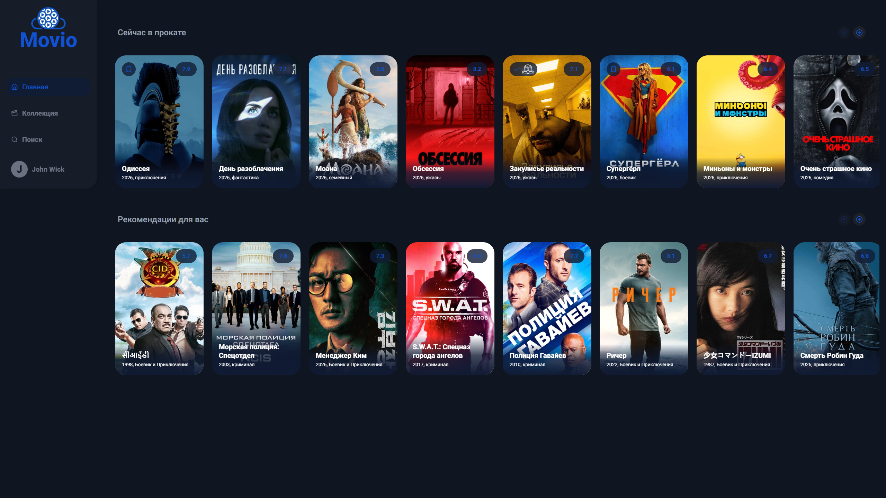
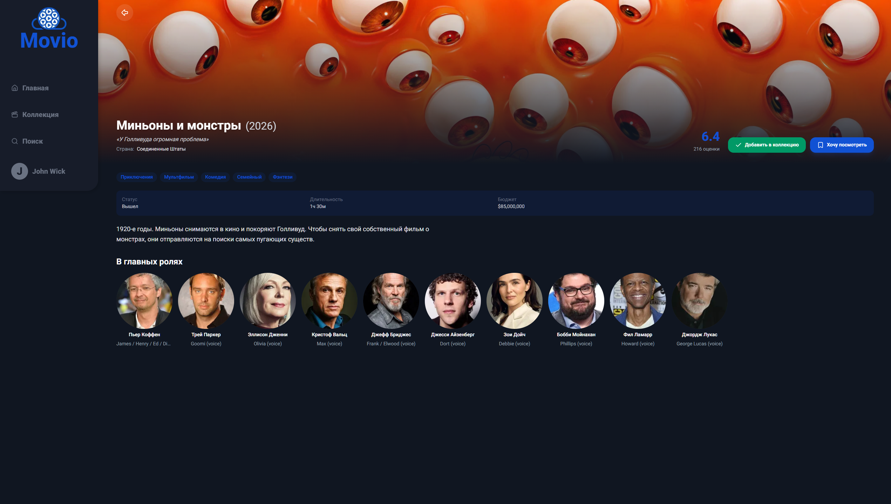
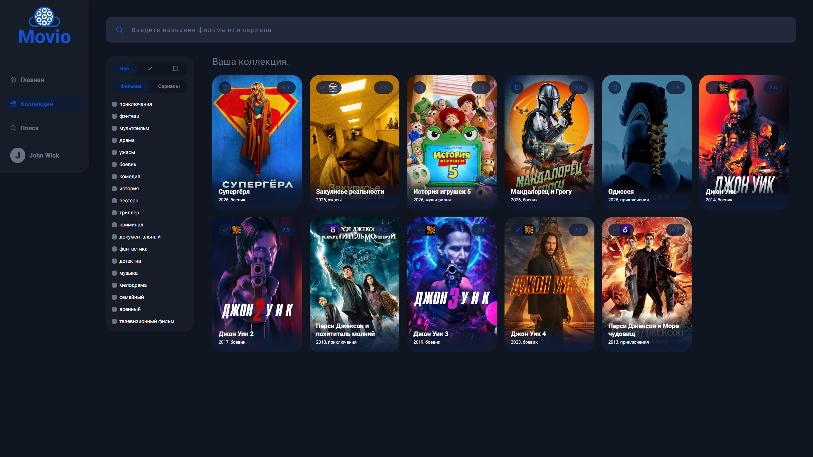
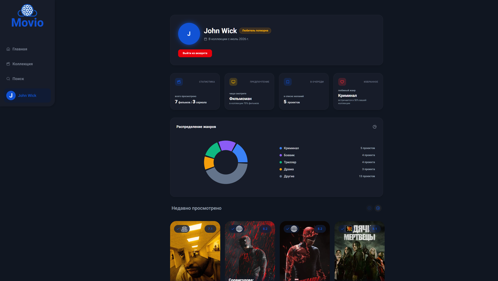

# Movio

<p align="left">
  
  
  
  
  
  
  
</p>

Веб-приложение для отслеживания и коллекционирования фильмов и сериалов. Синхронизирует данные пользователей с Firebase Firestore, использует Auth.js v5 для авторизации и TMDB API в качестве основного источника данных.

🔗 **Live Demo:** [movio-next.vercel.app](https://movio-next.vercel.app)

---

## Скриншоты

| Главная страница | Детали проекта |
| :---: | :---: |
|  |  |

| Личная коллекция | Аналитика |
| :---: | :---: |
|  |  |

---

## Функционал

- **Каталог & Поиск:** Интеграция с TMDB API (актуальная база фильмов, сериалов, актёров).
- **Коллекции:** Группировка проектов по статусам («Просмотрено», «В планах»).
- **Платформы:** Фиксация сервиса, на котором был просмотрен конкретный проект.
- **Аналитика:** Визуализация статистики просмотров и предпочтений на Recharts.
- **Аутентификация:** Защита роутов и сессии через Auth.js v5 (NextAuth) + bcryptjs.
- **UI/UX:** Адаптивный тёмный интерфейс, плавная анимация на Framer Motion, свайпер на Embla Carousel и тосты Sonner.

---

## Стек технологий

* **Core:** Next.js 16 (App Router), React 19, TypeScript
* **Auth & DB:** Auth.js v5 (`next-auth`), Firebase Firestore, Bcryptjs
* **State & Validation:** Zustand 5, Zod 4
* **UI & Styling:** Tailwind CSS 4, Framer Motion 12, Embla Carousel, Recharts, Lucide Icons, Sonner

---

## Локальный запуск

1. **Клонировать репозиторий:**
   ```bash
   git clone [https://github.com/your-username/movio-next.git](https://github.com/your-username/movio-next.git)
   cd movio-next